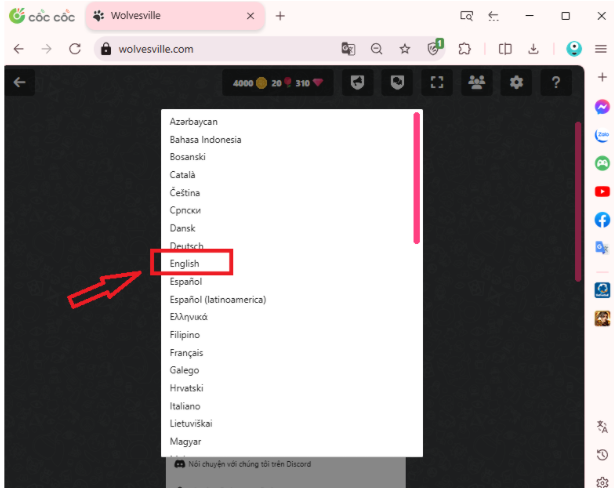
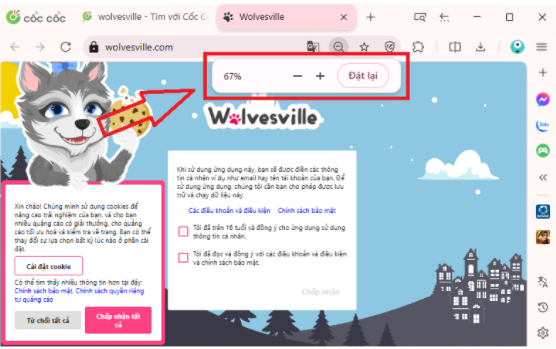
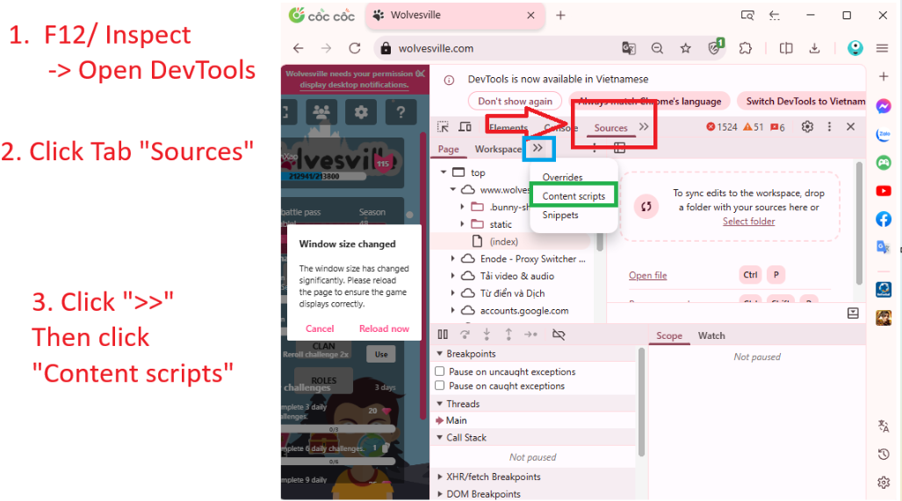
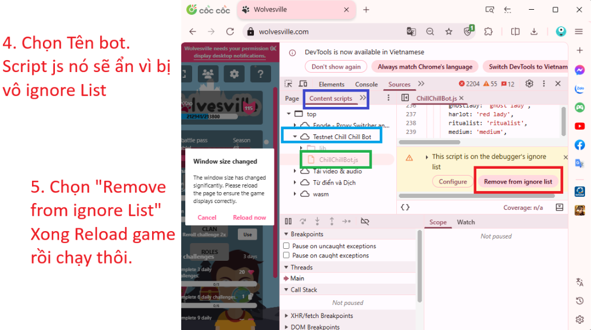

# Chill Chill Bot, bản độc quyền. Non-commercial

Auto Play for game https://www.wolvesville.com/

Current Version: 2.6
#


## Authors [@linlapkien](https://github.com/linlapkien)


## Custom mode

- Auto Replay game.
- Host lobby - click Start Game when 8 people.
- Auto Play in Night phase 
  -
  - As wolf, chat lover number, and vote their lover.
  - As Junior Werewolf, detect number of other wolf, then tagged the number, and chat: "Who? my couple is ${number}".
  - As wolf, detect Junior Werewolf in game, then vote the Junior lover.
- Auto Play in Day phase 
  - 
  - As alive player, vote according to everyone.
  - As alive player, if no player was voted, detect in chat "me, m, wc" then vote that player.
  - As wolf, chat "me'.
  - As Fool, Anarchist, Serial Killer, Evil Detective, Arsonist, Chat in Days "I'm ${Role}", For ex: "I'm Fool".
  - As non-wolf role, detect lover is wolf or not, if yes, vote their lover.
  - As Gunner, Click on bullet image, then shoot voted player.
  - As Priest, Click on water image, then throw to voted player. 
  - As Priest, detect lover is wolf or not, if yes, throw random player.
  - As Mayor, Click mayor hat, then vote according to everyone.
  - As Ritualist, Select random alive player in night phase.
  - As Baker, Randomly give bread to alive players.

   
# 

## Bst mode - Not fix auto play, only auto replay game

- Auto Replay game.
- Auto Play in Day phase 
  - 
  - As alive player, vote according to everyone.

   
# 

## Fool mode - Private room

- Auto Replay game.
- Auto Play as fool lobby

#

## Installation

Download https://github.com/linlapkien/Chill-Chill-Bot 

```bash
  Open browser
  -> Manage extension
  -> Turn on "Development Mode"
  -> Click "Load Unpacked" button
  -> put the file that download above.
  -> Open the game "https://www.wolvesville.com/" and enjoy !!
```
    
## What will be fix in this version 2.5?

#### 1. Thêm UI Dashboard, để nhập Username và Token.

#### 2. Có thể Chạy Bot hoặc Ngưng Bot trên Dashboard


#

## Feedback

If you have any feedback, please reach out to Lin (LinXauTinh).


## Support

For support, leave message to Lin.


## Trouble shooting - 1 số lỗi có thể gặp khi cài bot.
Dưới đây là tổng hợp các lỗi phổ biến và cách xử lý nhanh khi cài đặt và vận hành Bot.

### 1. Bot báo "Running" nhưng không hoạt động
Nguyên nhân: Thường do sai lệch ngôn ngữ hiển thị trong trò chơi khiến Bot không nhận diện
được các phần tử.
```bash
> **Cách fix**: Kiểm tra và chuyển ngôn ngữ trong game sang **Tiếng Anh (English)**.
```



### 2. Giao diện thu nhỏ nhưng làm Bot không thể click nút.
Nguyên nhân: Tỷ lệ hiển thị (Zoom) của trình duyệt không tương thích với tọa độ click của Bot.
```bash
> **Cách fix**: Tối ưu nhất là để size **50% - 67%** trong trình duyệt.
Dùng phím tắt **Ctrl - hoặc Ctrl +** để zoom out/in đúng kích thước.
```



### 3. Bot chỉ Chat được, không tự động Click được
Nguyên nhân: Content Script của Bot có thể đã bị trình duyệt đưa vào danh sách bỏ qua
(Ignore List).
```bash
> **Cách fix**: Thực hiện theo quy trình Debug sau:
1. Nhấn **F12 (Inspect)**.
2. Chuyển sang tab **Sources**.
3. Chọn **Content Script**.
4. Nhấn chọn ""Remove from ignore list"".
```




